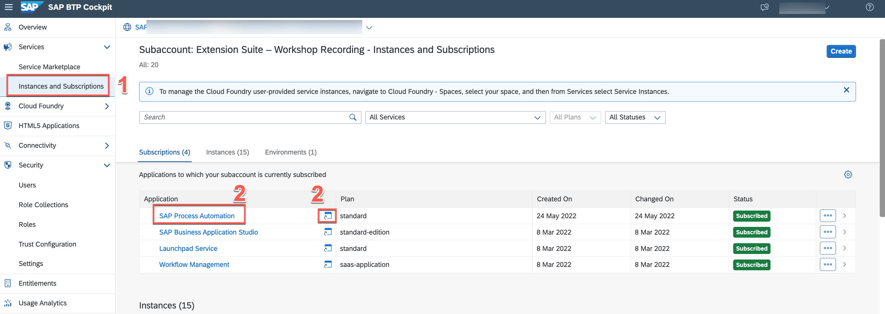
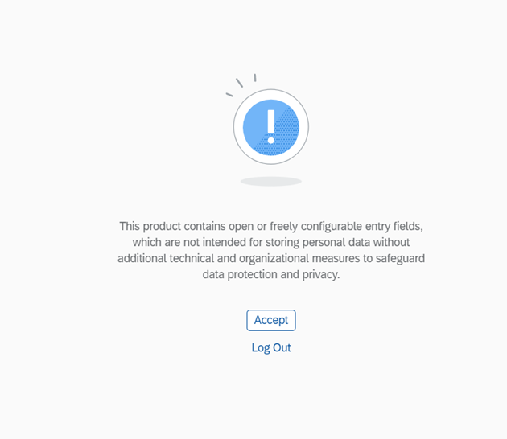
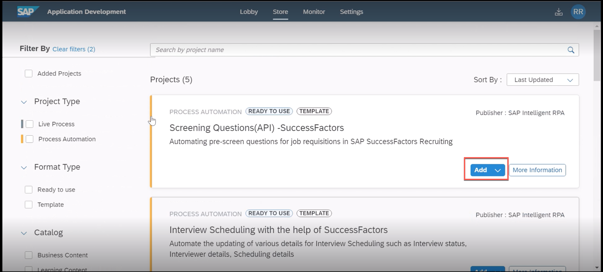
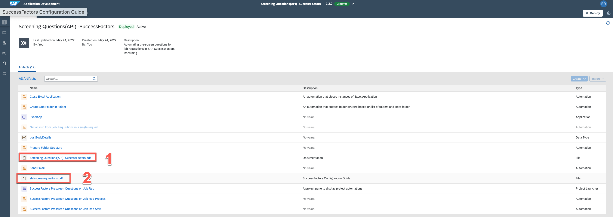
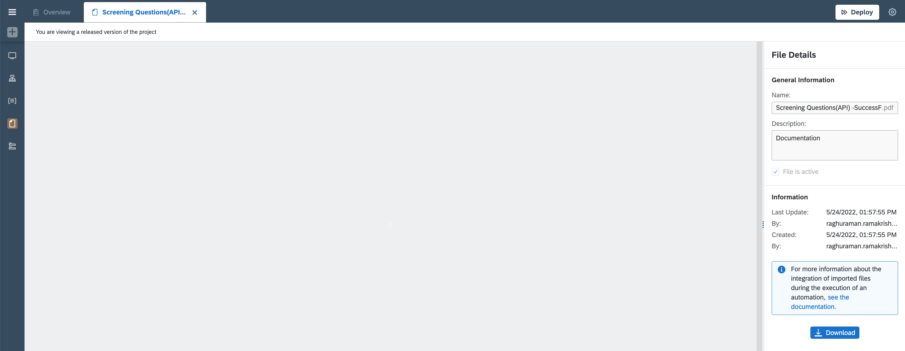
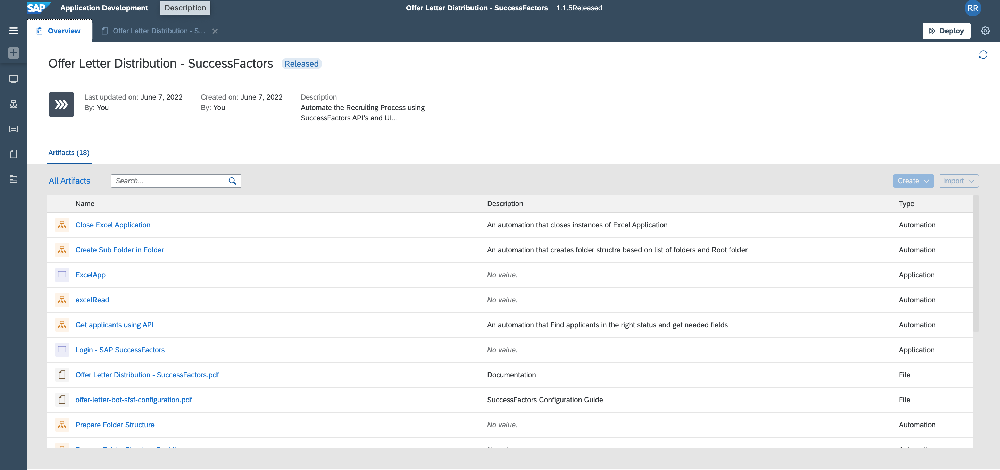
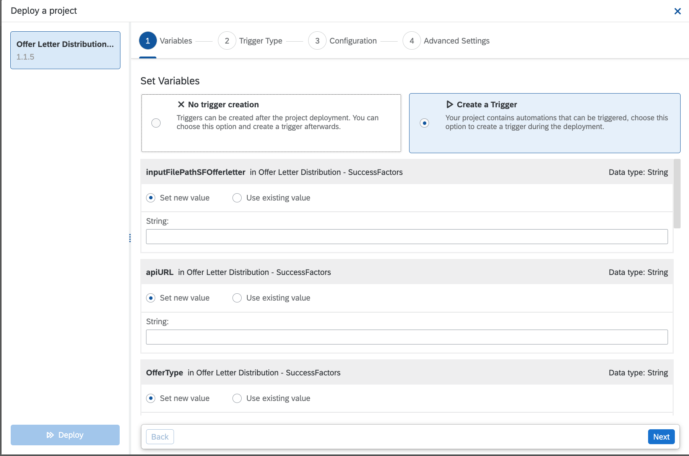
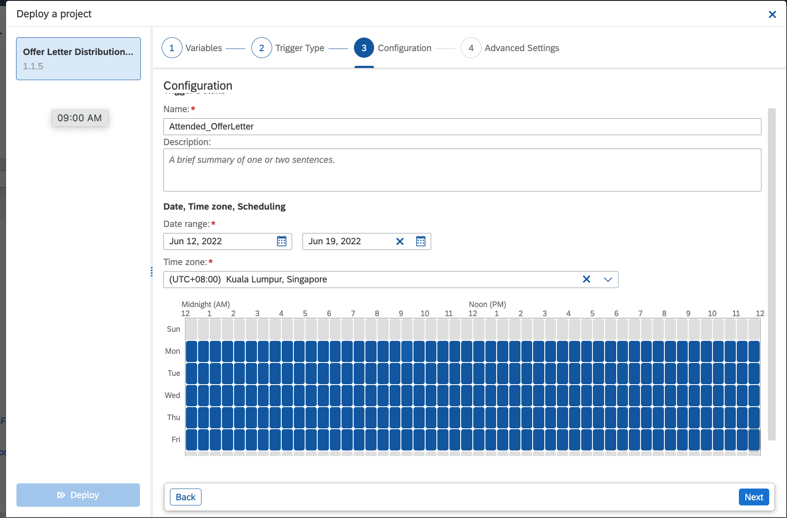
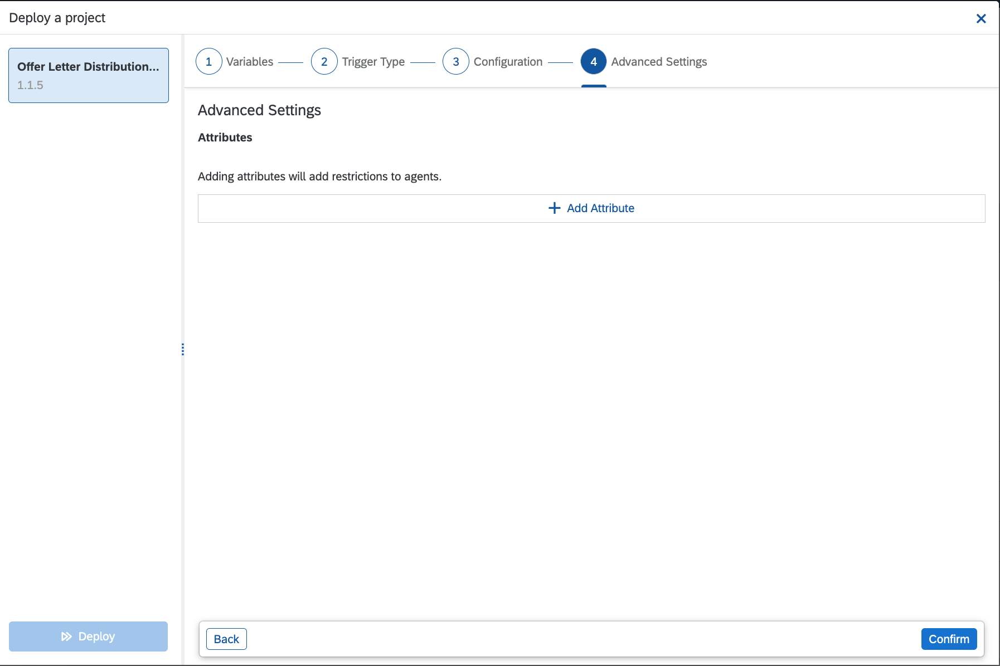
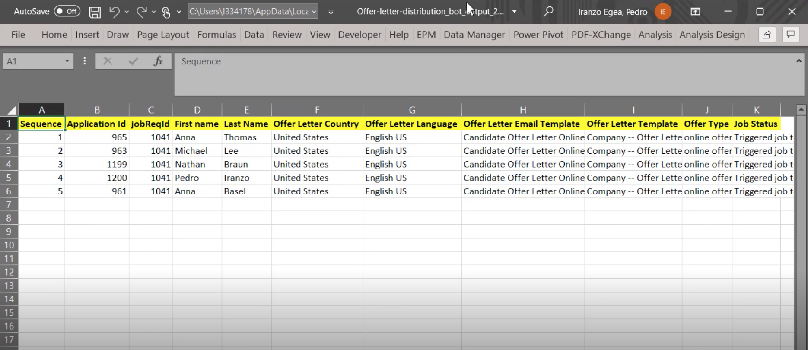

In the next series of tasks, you will download the automations from the SAP Process Automation Store and execute them.

>What is SAP Process Automation Store?
>The Store is available for everyone and can be accessed directly from the SAP Process Automation product home page within the product. The store offers prebuilt content created and curated by SAP which can be used free of charge with SAP Process Automation. Any automations built by SAP Partners and accessed through the store will have to be purchased as per the invidiual automations terms and conditions laid out in SAP Store & by the SAP Partner. The store also offers a variety of filters, a search feature, and content descriptions to help users find what they are looking for quickly.
>For more information, please refer to our documentation [page!](https:/help.sap.com/docs/PROCESS_AUTOMATION/527c579a1cba4f12b45326c8e890d102/8324854ae0ba400296ee384d35f95235.html?locale=en-US)

Explore the store as described in the documentation page [Explore the Store | SAP Help Portal!](https:/help.sap.com/docs/PROCESS_AUTOMATION/527c579a1cba4f12b45326c8e890d102/b38897b821874ebe98fb15fc7d4400e9.html?locale=en-US))

We will be using couple of Automations from the SAP Process Automation Store

1. Screening Questions(API) -SuccessFactors
2. Offer Letter Distribution - SuccessFactors

Instructions to download Automations from SAP Process Automation Store

1. From your Sub account, go to Instances and Subscriptions menu (1),
2. Launch SAP Process Automation (2) by clicking the name or the icon beside it 
2a. If it is first time you are loading, you will get a warning message like this below, Kindly review and act on the pop up message.

3. From the SAP Process Automation Lobby, Navigate to SAP Process Automation Store

4. Filter Products to SAP SuccessFactors and locate the offer letter automations. You can click the **Add** button. the screenshot here points to PreScreenQuestions, you can similarly search and add Offer Letter Automation and click on the Add button

5. You can also review the description by clicking **More Information**  and details about the automations and click the Add button with in the Automation details page.

6. After few seconds downloaded project is accessible from the lobby, Like other Store content, each project consists of relevant screen captures, automations, templated excel files (if applicable) and relevant configuration documentations and other general documentations.
7. From within the project we will explore the files it contains, locate the  SAP Process Automation Configuration files (1) and SuccessFactors Configuration file (2) and download it from the detail page to your local computer.

8. Download from the details page

9. Repeat the same step for SuccessFactors Configuration guide.
10. Repeat the steps from **Step 3** and download offer letter automation related project from the store, and later download the SAP Process Automation Configurations & Success Factors Configuration for offer letter distribution.

As a pre-requisite, review the SAP Process Automation configuration for  **Offer Letter Distribution - SuccessFactors**

>Note
>
> In order to test the automation, you will need at least one job requisition in the appropriate status = Offer, and Substatus = Read to offer for automation to identify that it needs to roll out the offer letter. This is as per the SuccessFactors configuration guide previously explained.

You will be in need your SuccessFactors tenant specific values for the below enviroment variables

Name | Description | Type | Sample | is it Mandatory?
------------ | ------------ | ------------ | ------------| ------------
apiURL| [API URL of SuccessFactors (see KBA 2215682)!](https:/userapps.support.sap.com/sap/support/knowledge/en/2215682) |String | [https:/apisalesdemo4.successfactors.com:443/odata/v2!](https:/apisalesdemo4.successfactors.com/odata/v2)| Required
botuser| Bot user username and password |Credential | botuser/password| Required
companyId| CompanyID of the SuccessFactors instance |String | SFPART012345| Required
botStep| Applicant status where candidates will be placed to be picked up by the bot |String | Request Offer Letter| Required
OfferType| Offer type the bot will send. Options are: 1) Online offer (2) Verbal offer (3) Email as text (4) Email as PDF attachment |String | Online offer | Required
sfurl| SuccesFactors application URL |String | [https:/salesdemo4.successfactors.com/!](https:/salesdemo4.successfactors.com/)| Required
outputFolderPath| Folder Path to save bot execution logfile |String | C:\Temp| Optional
logEmail| Email that will receive bot execution logs |String | [sfadminEmail@bestRunSAP.com!](mailto:sfadminEmail@bestRunSAP.com)| Optional
inputFilePathSFOfferLetter| Input File Path (Only required when you are triggering SF_Offer_Letter_UI_Only_Start Automation) |String | C:\Temp\Input\file.xlsx| Optional
#### 11. Start Deployment

From the project screen, click the Deploy button

#### 12. Deploy Automation & Configure variables

#### 13. Configure Trigger Type

#### 14. Define Automation Execution Schedule

#### 15.  Confirm & Deploy

Based on your trigger type, the automation will be triggered in either attended or scheduled mode.

At the end of each execution, bot will prepare a log file in excel format and email to the configured recepient at the time of deployment.

#### Excel Based Log

