For this tutorial, we will be using the below APIs from SAP API Business Hub

* Employment Information [Employment Information](https://api.sap.com/api/ECEmploymentInformation/overview)
* Personal Information [Personal Information](https://api.sap.com/api/ECPersonalInformation/overview)

You also need to be familiar to What is an Actions Project.
Kindly refer to our documentation [Actions Project from SAP Help](https://help.sap.com/docs/PROCESS_AUTOMATION/a331c4ef0a9d48a89c779fd449c022e7/609538e04bc843d887011765c14ecdda.html)
and few community resources below

* [SAP Process Automation – Your first simple Action Project: End to End](https://blogs.sap.com/2022/10/21/sap-process-automation-your-first-simple-action-project-end-to-end/)
* [Connect to External Systems using Actions in SAP Process Automation](https://blogs.sap.com/2022/10/21/connect-to-external-systems-using-actions-in-sap-process-automation/)
* [SAP Process Automation – Consume APIs with ‘no-code’ using Actions](https://blogs.sap.com/2022/10/21/sap-process-automation-consume-apis-with-using-actions/)
* [The New Actions Project – Major Changes including the Actions Editor Available Now !!](https://blogs.sap.com/2022/10/19/the-new-actions-project-major-changes-including-the-actions-editor-available-now/)

Instructions | Image
------------ | -----
RR1. As a First step, let us download JSON specification of the required APIs | 
RR2. From the SAP Process Automation Create an Actions Project | 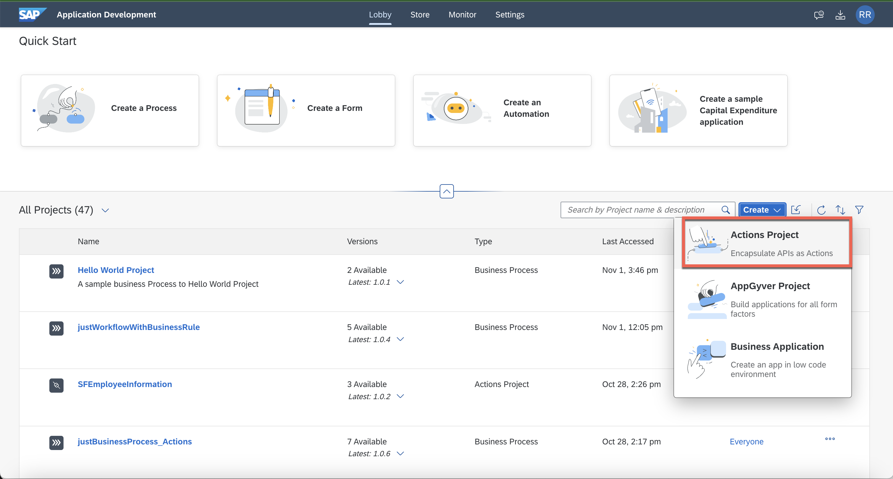
RR3. Upload the JSON API Specification downloaded from SAP API Business hub | 
RR4. In the next screen, select required APIs. it is the **Get** call for **EmpJob**. Click Add in the end | 
RR5. Once you add, you will get the detail view of the Added APIs | 
RR6. Release and deploy the actions project. |
RR7. Do the same thing for **PerEmail** API from SF Employee Central Personal Information API|
RR8. In the end 2 action project are created, released and deployed and available with similar names in your SAP Process Automation Lobby | 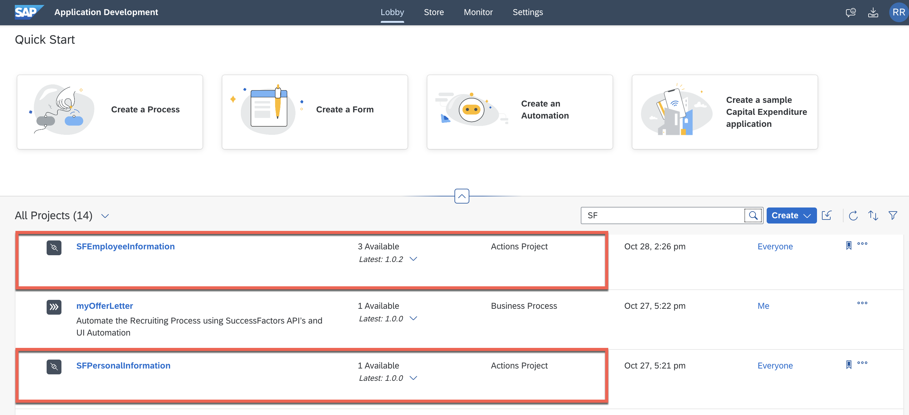
RR9.Let us create a brand new Business Process Project called **<Your Name>_Training Approval Project** | 
RR10. Add a new Business Process | 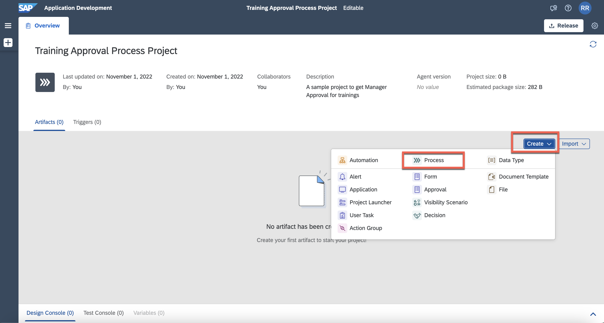
RR11. Give a name to your Business Process | 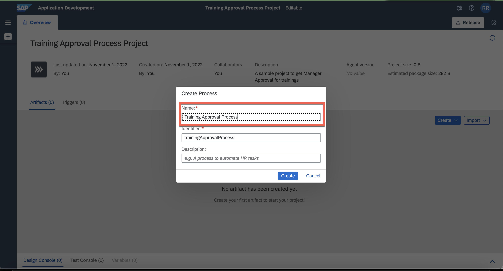
RR12. Add a request form to this business process | 
RR13. Give a name to the newly added form | 
RR14. Open the newly created Request Form | 
RR15. Add the required fields. here is a suggestion | 
RR16. Create a Data Type called **Employee** | 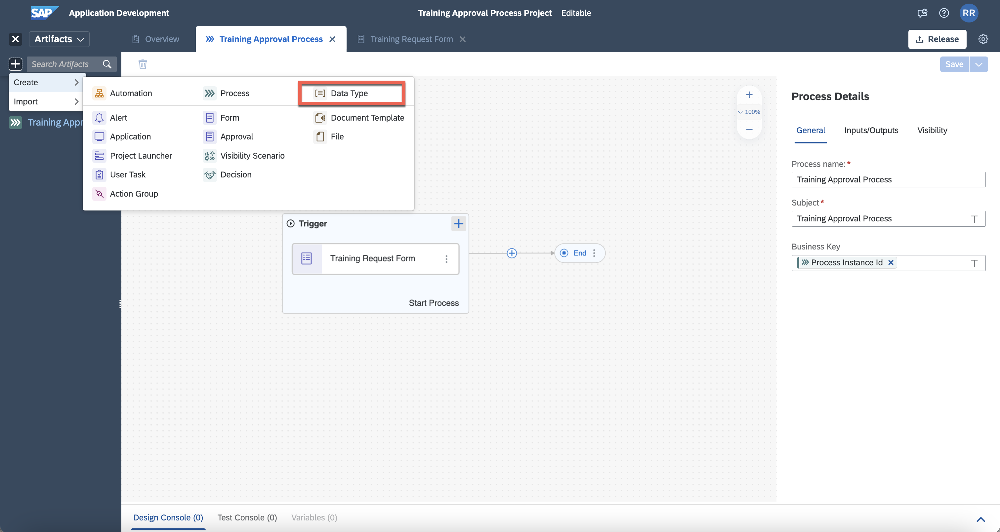
RR17. Add Required Fields to **Employee** datatype | 
RR18. Similarly create another data type **ProcessingData** | 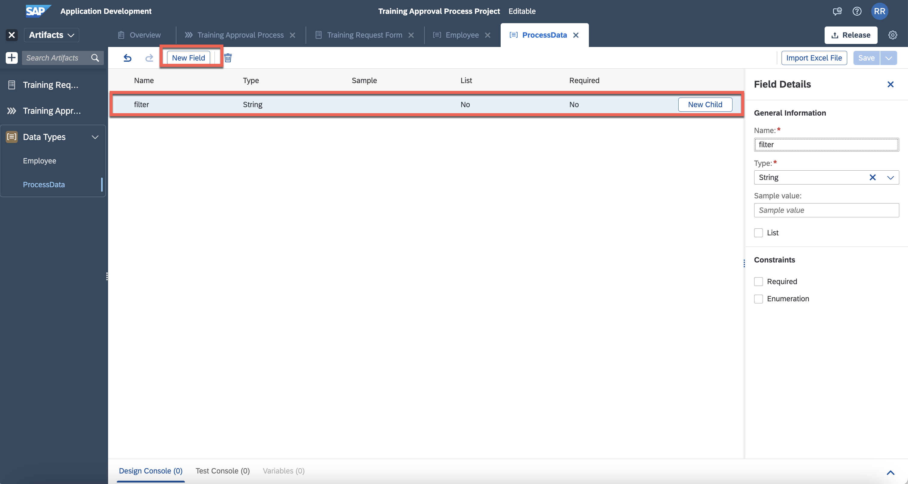
RR19. These data types are required as the Action Skills's expression editor is still evolving. We needed $filter: userId eq <given_user_id> in the Action API call. We will use a dummy rule to create such an output twice. |
RR20. Add a New Decision1 to process Filter using UserID field | 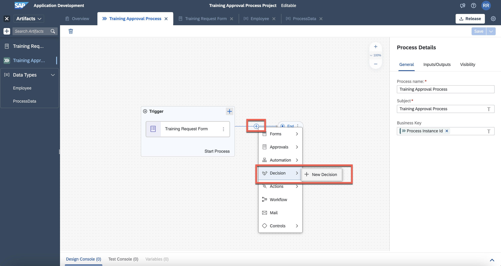
RR21. Name your Decision. Open the newly created decision | 
RR22. Design Decision input **Employee** and output as **ProcessData** | 
RR23. Add a new Rule to this decision | 
RR24. Name the rule  as **Determine Filter**. It will be a text rule | 
RR25. Add the necessary output parameter under the configuration tab | 
RR26. This rule always is expected to return `'userId eq ' + rule_input1.UserId` | 
RR27. Switch to the business Process and configure decision input | 
RR28. Now it is time to make the **EmpJob** API call to determine manager id for the given user id | 
RR29. As a first step, refer to the preconfigured destination for this actions project. Destination through an environment variable. We needed to add an environment variable | 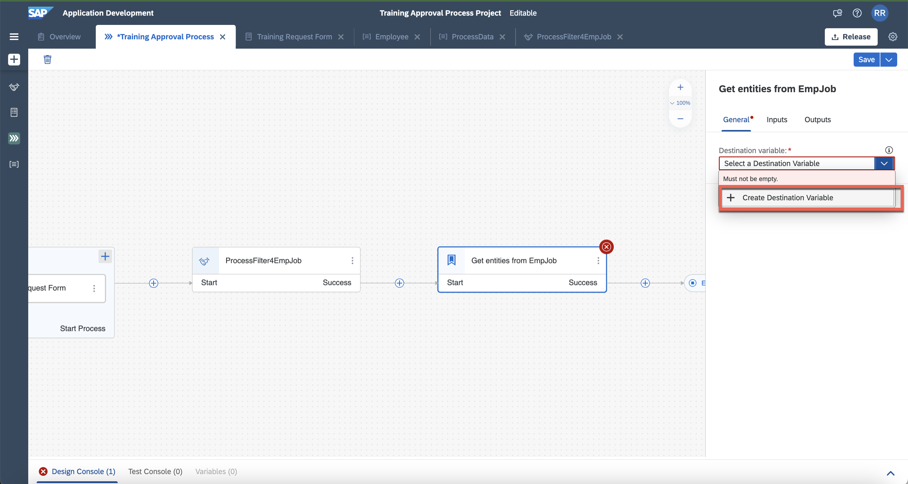
RR30. Name the destination variable | 
RR31. In the end, after adding destination it will look like this | 
RR32. We will configure filter parameter based on the decision output. This will be equivalent to such an API call in postman '{{baseUrl}}/EmpJob?&$filter=userId eq '<userid> | 
RR33. The result of the API call will contain managerID. we needed this in filter form for **PerEmail** Action call |
RR34. We will build another decision, exactly the same way which will output differently this time. Open the newly added Decision | 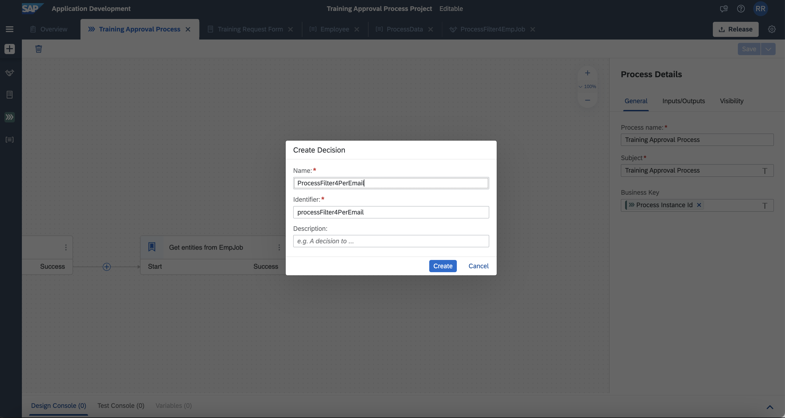
RR35. This is how the new decision input and output will be designed | 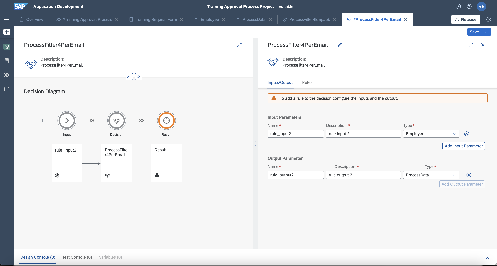
RR36. Similarly add a new text rule, configure filter as output parameter and create the text rule. | 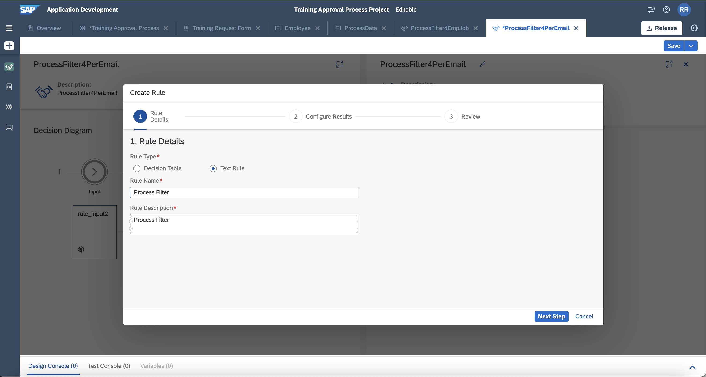
RR37. The design of this rule is almost similar, expect its output was different. | 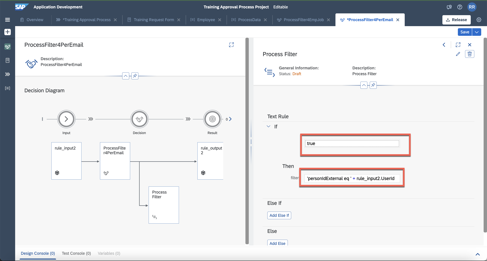
RR38. After saving the decision, switch to business process, configure input to the decision based on the outcome of **EmpJob** Action call. | 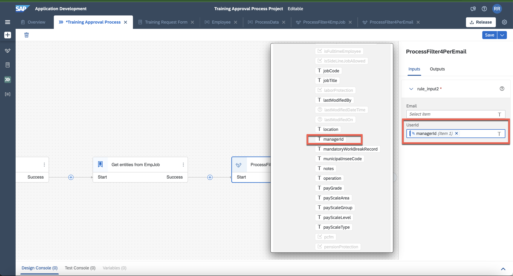
RR39. We will include from Action Library **PerEmail** api call.  | 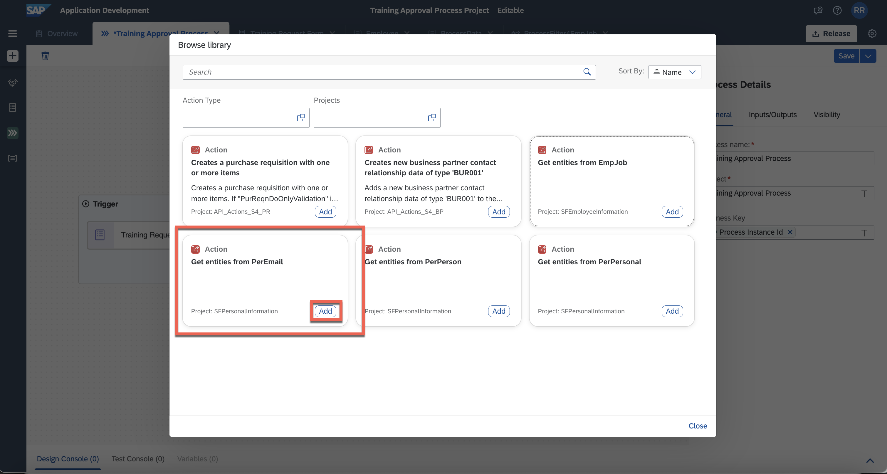
RR40. Configure Destination and filter parameters | 
RR41. Here is after adding filter parameter | 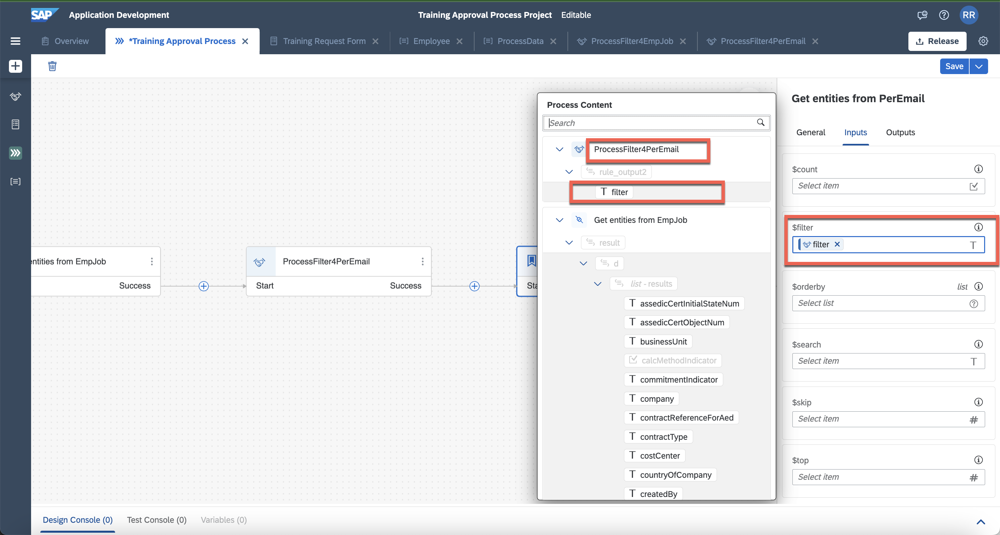
RR42. At this point, we have manager email with us. We can assign an approval task to the requester's manager. Again, we are handicapped by a particular product issue, that json output from Action is not readable for Approval Form Input. I will be filling a bug. In the meantime we will create another rule that will take email as input and return same email as output. its funny, please live with it. |
RR43. We will add a new decision, call it **Process Email** , take employee as input and output | 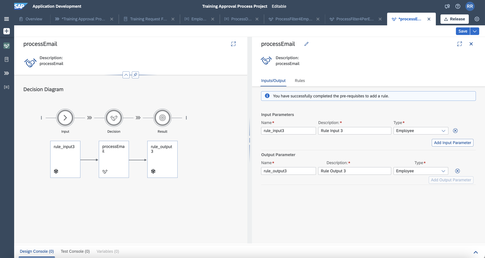
RR44. We will create a text rule, In the configurations tab, just make sure you select email | 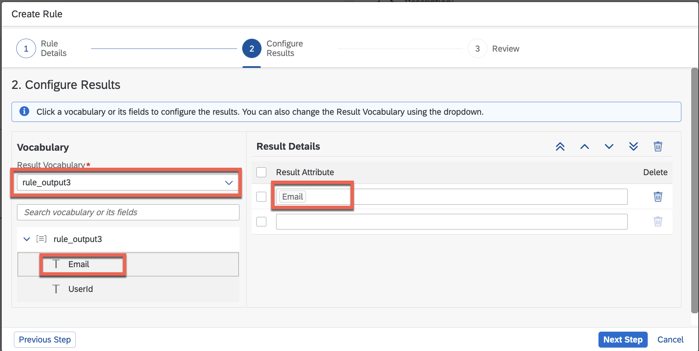
RR45. Finally you return the same email as output | 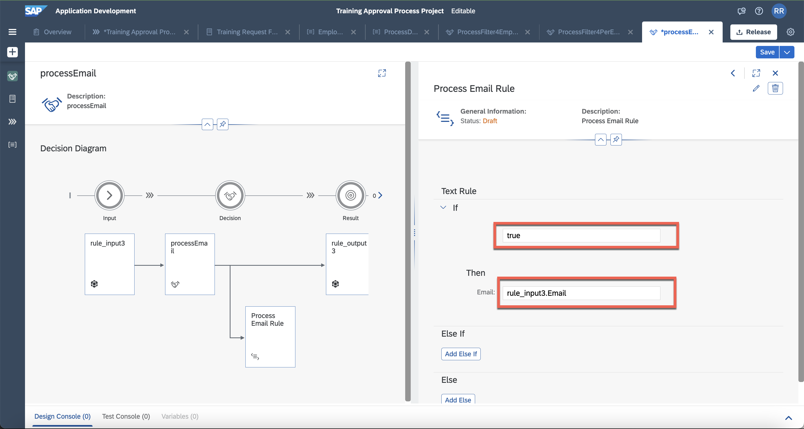
RR46. Switch to the Business Process and configure decision input from Action output | 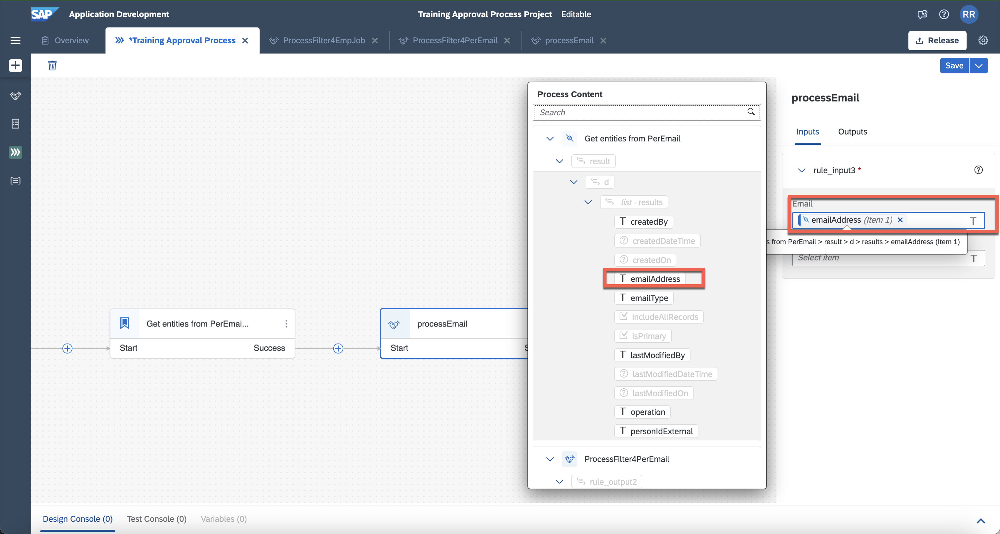
RR47. We will create an approval form  | 
RR48. This new approval form will be based on the existing request form | 
RR49. As this task will be assigned to requester's manager, we will configure General tab with proper input | 
RR50. Now we will map every field from the request form with the corresponding field in approval form | 
RR51. Open the Approval form, ensure all fields from request form are readonly and add a manager's comments field. | 
RR52. One final step is remaining. Switch to the business process, for the rejection workflow add an end for now | 
RR53. You can release and deploy the business process. In the deployed process, find the url from the request form to test | 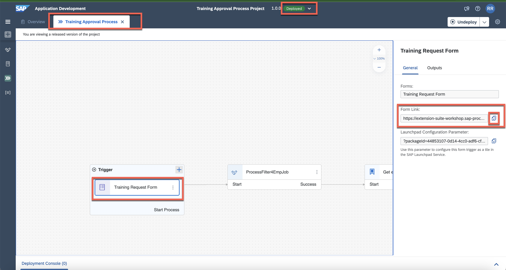
