This Hello World Project is to introduce you various components of SAP Process Automation. But Something is not right, in place of Full Name, we pointed it to First Name. In this tutorial we will use a Business Rule to combine First Name, Last Name and Email

Instructions | Image
------------ | -----
B1. Open the editable version of the project, switch to the Business Process. | 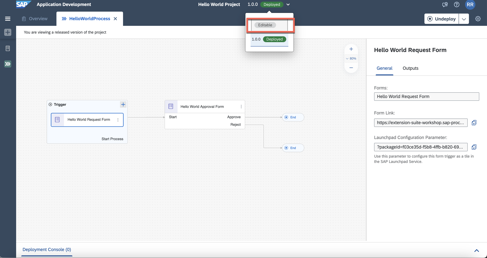
B2. Add a Decision between Request and Approval Forms | 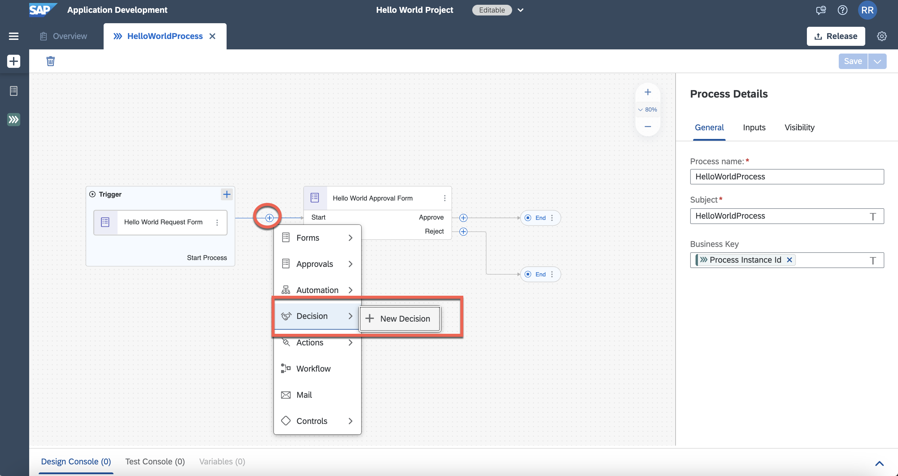
B3. Give a name to this decision  | 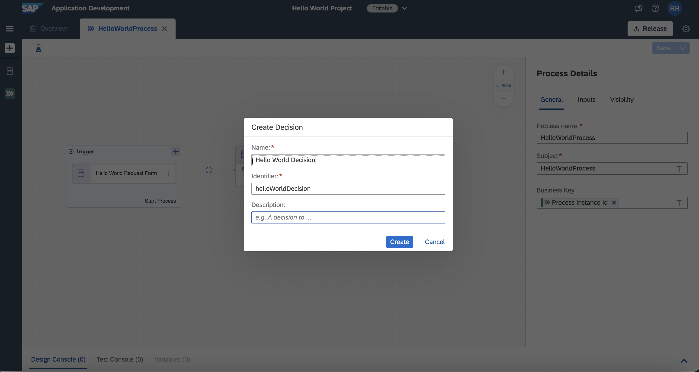
B4. Decisions are based on data types. Let us create a Requester DataType | 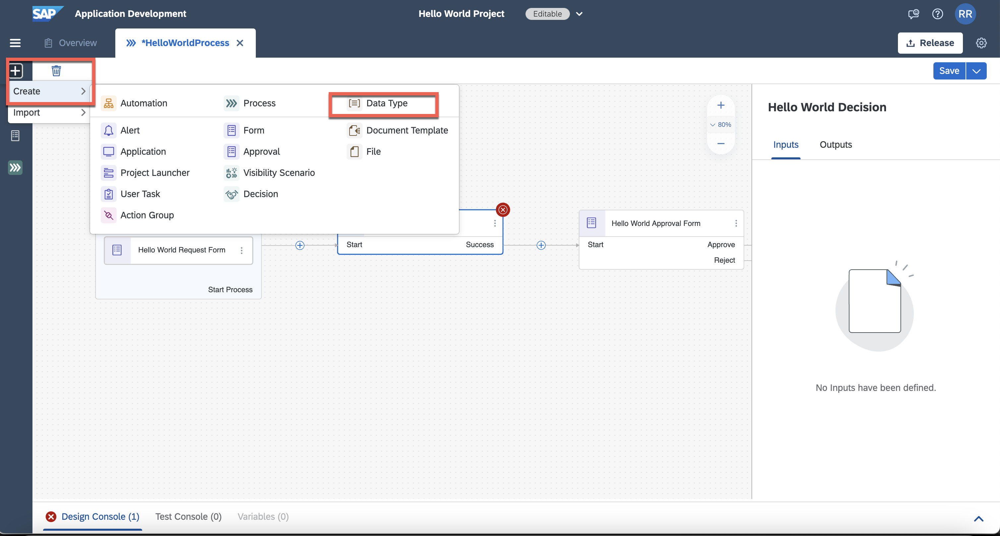
B5. Name the Data Type | 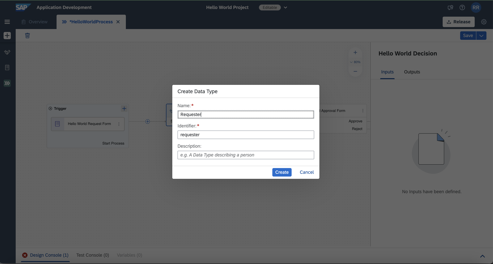
B6. Add Fields to this newly created Data Type | 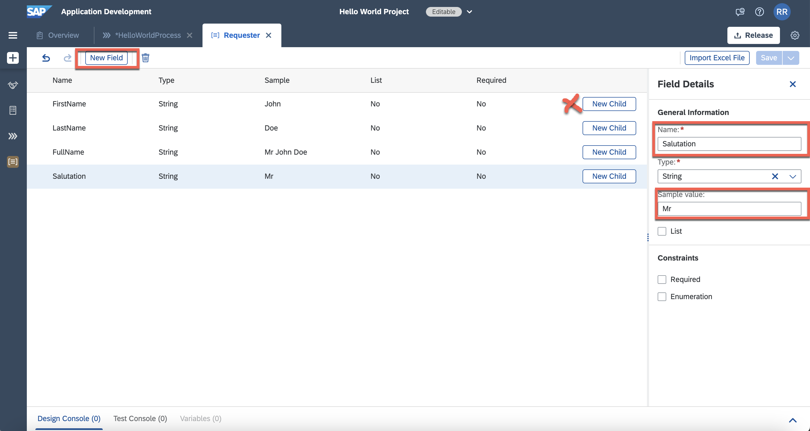
B7. Switch to Hello World Decision | 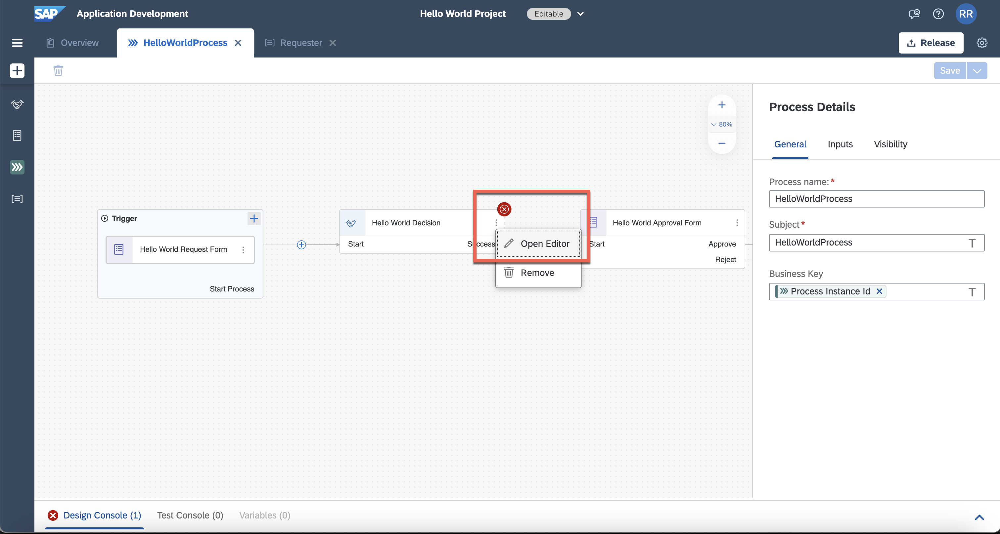
B8. In the decision view, add required input parameters. Switch to the Rules Tab in the end. | 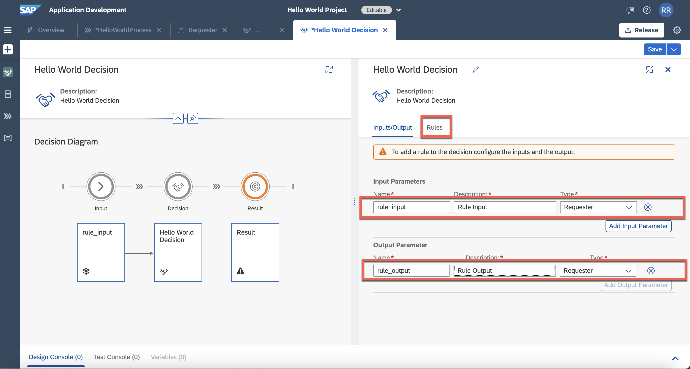
B9. Now Add a Rule to the Decision. | 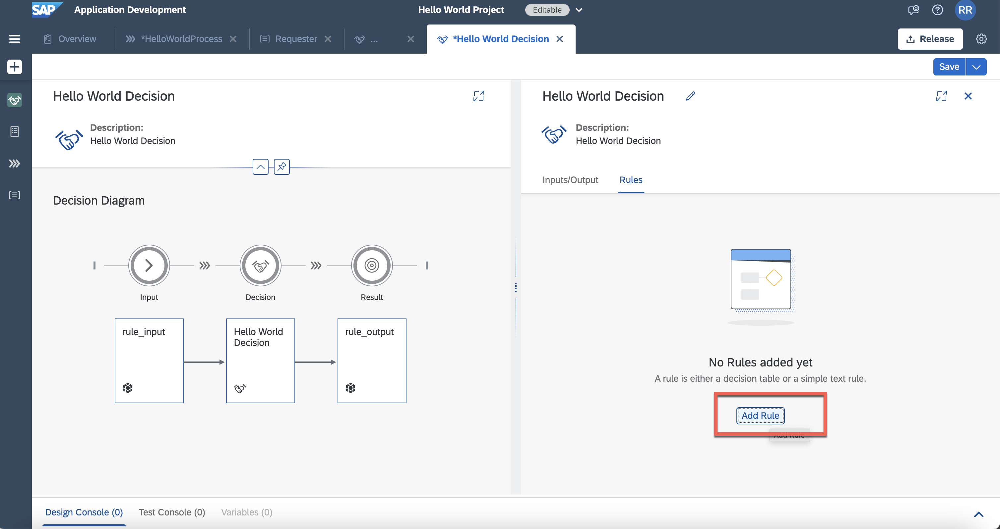
B10. Name the Rule within the decision, Select Text Decision | 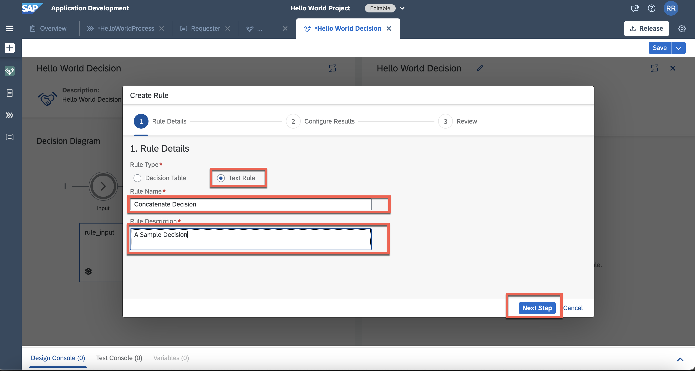
B11. Pick rule_output as result vocabulary. Select FullName Field as the field. Click Next and Create the rule. | 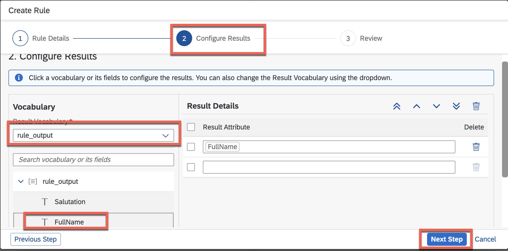
B12. It will present an IF / Else Text Rule template. Use true for the **If** Clause | 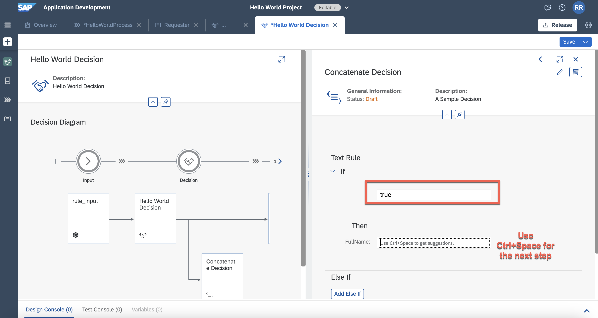
B13. You can use the helper function, locate **CONCAT** Function under Advanced Functions, select the **Salutations, FirstName, LastName** fields | 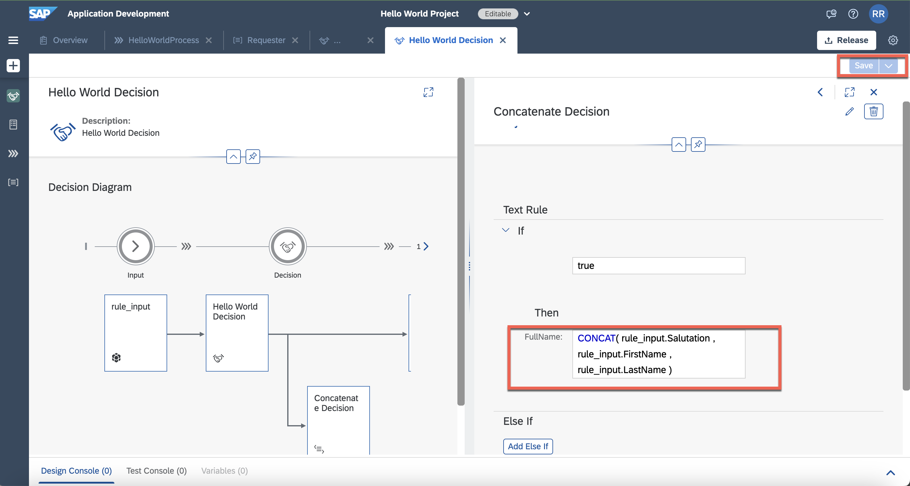
B14. You can pick your function or fields easily using the helper popup | 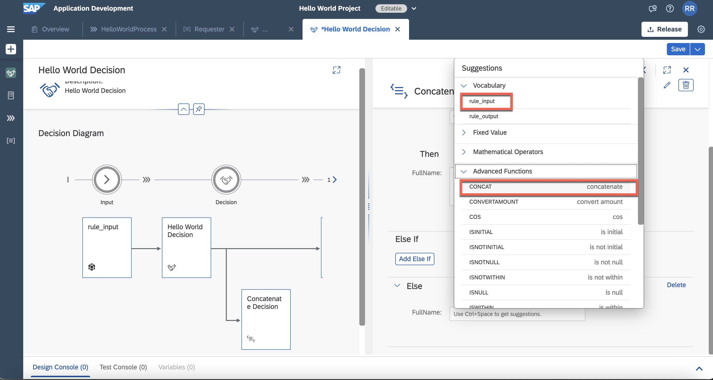
B15. Switch to the Business Process Tab, select the newly added Decision entity, map the fields | 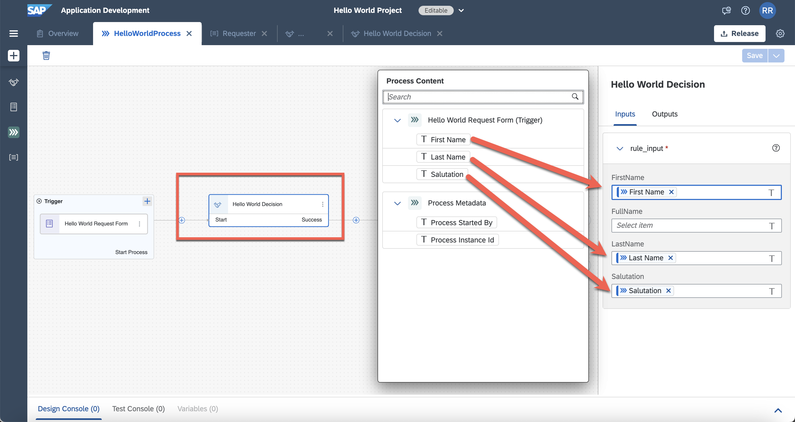
B16. This also warrants a change in Approval Form Input. We need it to take the output of decision | 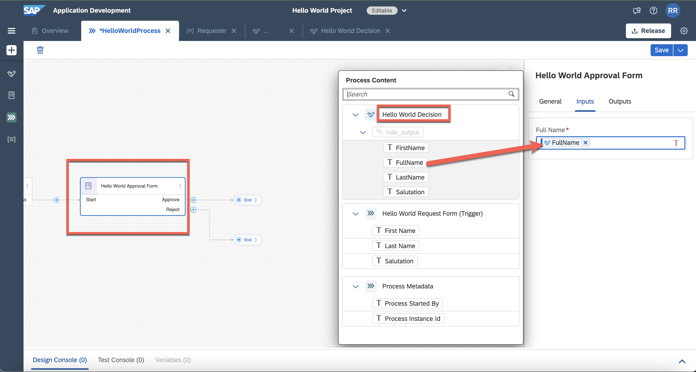
B17. Save all the artifacts, release the project again. As it is small change, we will consider it as **Consider Only Patches** | 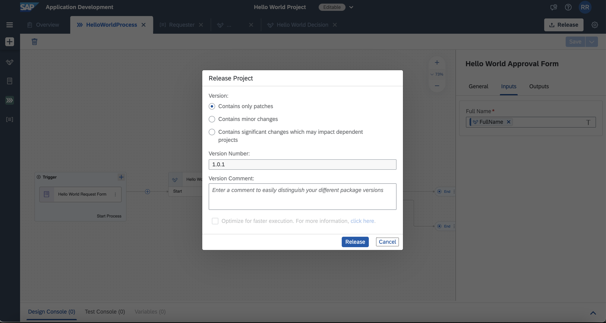
B18. Deploy the project |
B19. Open the business process from the deployed project, click the request form and copy the form link url to open in a new browser tab.  | 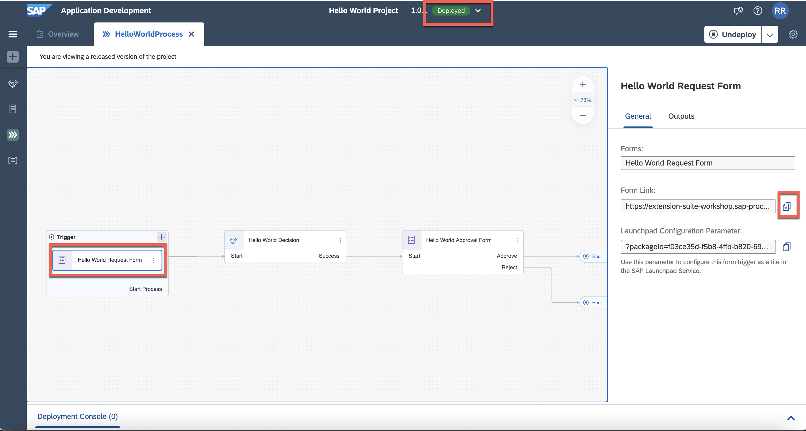
B20. Submit with a sample details and submit |
B21. Switch to Lobby, open my inbox. you will see the work of the decision. it can be better with few spaces :-) | 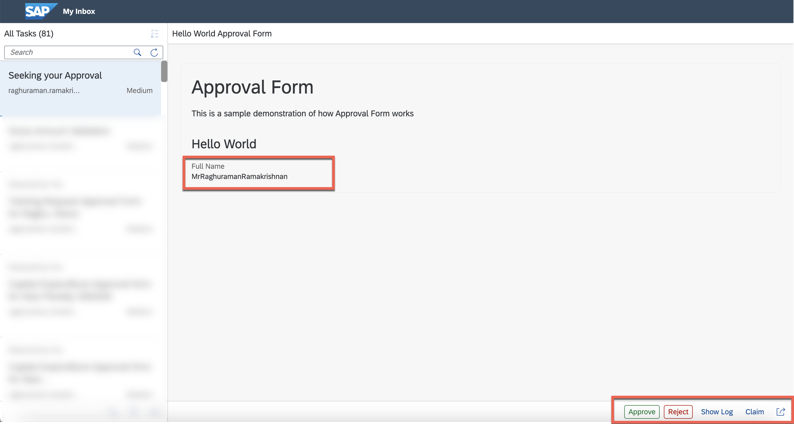

**END**
