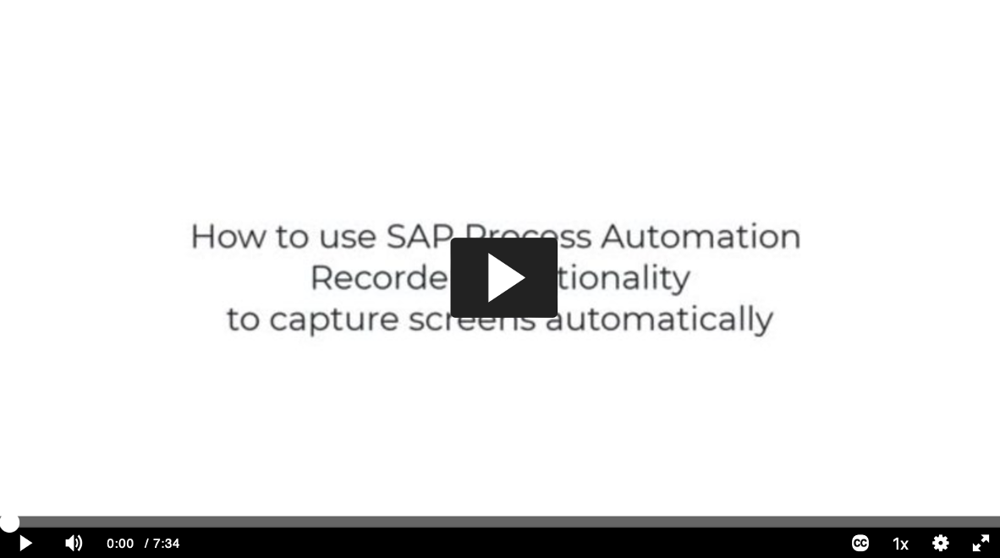
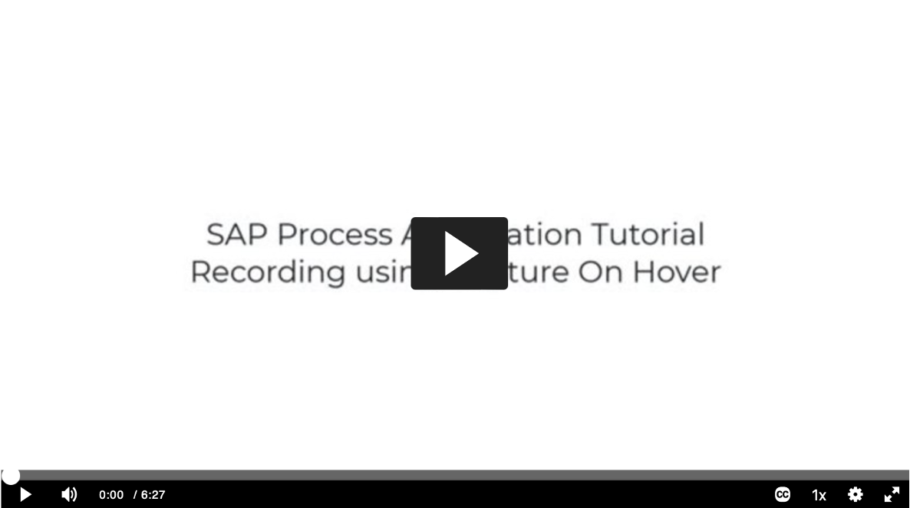
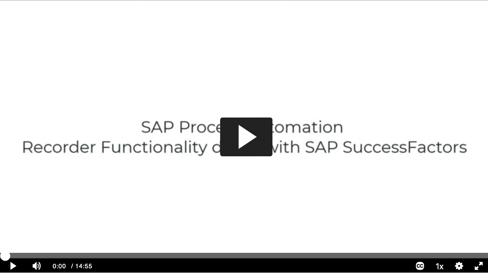

In this tutorial, we will be covering basics of SAP Process Automation - Automation recorder capabilities.

###Tutorial - How to use Automatic Recorder Capability

Click the image below to access the tutorial video (right click and open in a new window) and follow it step by step to understand how the functionality works

||
-

###Tutorial - How to use Capture - On - Hover Recorder Capability

Click the image below to access the tutorial video (right click and open in a new window) and follow it step by step to understand how the functionality works

||
-

###Main Recorder Tutorial Video

Click the image below to access the tutorial video (right click and open in a new window) and follow it step by step to understand how the functionality works

||
-
